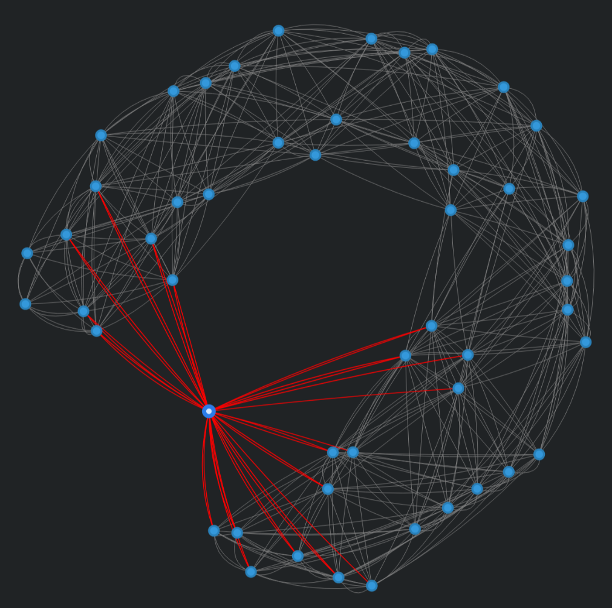
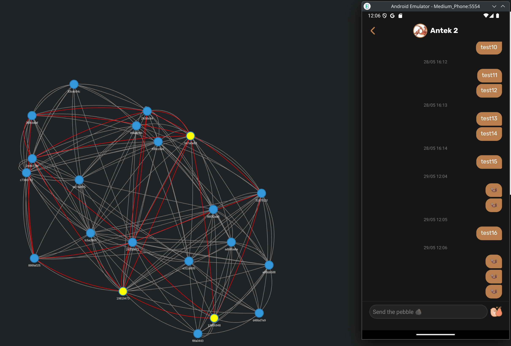

# WebRTC Peer Simulation Project

This project simulates a network of WebRTC peers, each running in its own process with a Distributed Hash Table (DHT) instance derived from the original project (see [OtterPeer](https://github.com/OtterPeer/otter-peer)). It is fully compatible with messages from the original project, supporting features like PEX requests, signaling over data channels, routing of chat and signaling messages through the DHT, and caching logic for chat messages passed through the DHT.

## How to Run

1. Install dependencies:
   ```bash
   npm install
   ```
2. Start the simulation with the desired number of peers:
   ```bash
   node run-multiple-peers.js ${number_of_peers_to_spawn}
   ```
    - Replace `${number_of_peers_to_spawn}` with the number of peer processes to launch (e.g., `node run-multiple-peers.js 5` for 5 peers).

## What It Does

- **Spawns WebRTC Peers**: Each peer runs in a separate Node.js process, simulating a decentralized network.
- **DHT Instance**: Includes a DHT implementation copied from the original project ([placeholder link]), enabling peer discovery and message routing.
- **Compatibility**: Responds to PEX (Peer Exchange) requests and handles signaling messages over data channels, ensuring interoperability with the original project.
- **Message Routing**: Supports routing of chat and signaling messages through the DHT, with caching logic to store chat messages temporarily when recipients are offline.
- **Visualization**: Features a real-time visualization using `vis-network`, powered by a WebSocket server. The visualization renders connection events, messages, and other activities as they occur. Access it at `http://localhost:3000` after starting the simulation.

## Screenshots



